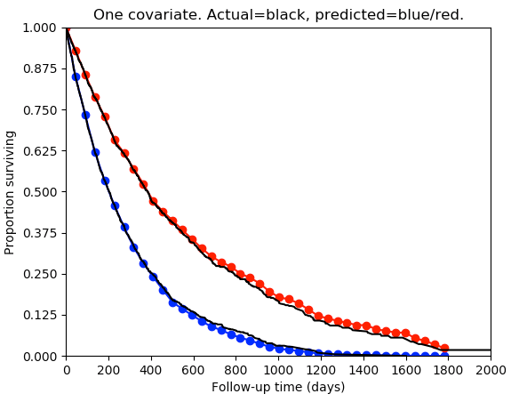

## Nnet-survival: A Scalable Discrete-Time Survival Model using Neural Networks

Michael F. Gensheimer and Balasubramanian Narasimhan  
Stanford University  
mgens@stanford.edu

[Link to PeerJ paper](https://peerj.com/articles/6257/)

Keras version is compatible with Python version 3.7+ and TensorFlow version 2.0+.

PyTorch version is compatible with Python version 3.10+ and PyTorch version 2.2+.

## Selected files

[nnet_survival.py: Keras version of Nnet-survival functions](nnet_survival.py)

[nnet_survival_examples.py: Examples of use of Nnet-survival](nnet_survival_examples.py)

[nnet_survival_pytorch.py: PyTorch version of Nnet-survival functions](nnet_survival_pytorch.py)

[nnet_survival_pytorch_example.ipynb: Simple example of use of PyTorch version of Nnet-survival](nnet_survival_pytorch_example.ipynb)

[support_study.py: Application of Nnet-survival to SUPPORT study data](support_study.py)

[Issues with Brown et al. 1997 loss function](brown1997_loss_function_example.md)

## Example of use (Keras version)

Load libraries, including *nnet_survival*:
```python
import numpy as np
import matplotlib.pyplot as plt
import matplotlib
from tensorflow.keras.models import Sequential, Model
from tensorflow.keras import optimizers, layers, regularizers
from tensorflow.keras.callbacks import EarlyStopping, ModelCheckpoint
from tensorflow.keras.layers import Input, Dense, Activation
from tensorflow.keras.models import load_model
from lifelines import KaplanMeierFitter
from lifelines import CoxPHFitter
from lifelines.utils import concordance_index
import nnet_survival
```

Create 39 equally spaced intervals for follow-up time, from 0 to 5 years:

```python
breaks=np.arange(0.,365.*5,365./8)
n_intervals=len(breaks)-1
timegap = breaks[1:] - breaks[:-1]

```

Create data for 5000 simulated patients. There is one covariate (call it *x*). The first half of the patients have *x*=0, and have exponential survival distribution with half-life 200 days. The second half of the patients have *x*=1, and have exponential survival distribution with half-life 400 days. Some patients are censored, with censoring half-life of 400 days.

```python
halflife1 = 200
halflife2 = 400
halflife_cens = 400
n_samples=5000
np.random.seed(seed=0)
t1 = np.random.exponential(scale=1 / (np.log(2)/halflife1), size=int(n_samples/2))
t2 = np.random.exponential(scale=1 / (np.log(2)/halflife2), size=int(n_samples/2))
t=np.concatenate((t1, t2))
censtime = np.random.exponential(scale=1 / (np.log(2)/(halflife_cens)), size=n_samples)
f = t<censtime
t[~f] = censtime[~f]
x_train = np.zeros(n_samples)
x_train[int(n_samples/2):]=1
```

Convert each patient's output data from (time, censoring indicator) format to a vector that for each time interval specifies whether the patient survived that time interval, and whether the patient failed during that time interval:

```python
y_train=nnet_survival.make_surv_array(t,f,breaks)
```

Train model, usuing a custom Keras loss function called *surv_likelihood*. For each time interval, a separate hazard rate is estimated.

```python
model = Sequential()
#Hidden layers would go here. For this example, using simple linear model with no hidden layers.
model.add(Dense(n_intervals,input_dim=1, kernel_initializer='zeros', bias_initializer='zeros'))
model.add(Activation('sigmoid'))
model.compile(loss=nnet_survival.surv_likelihood(n_intervals), optimizer=optimizers.RMSprop())
#model.summary()
early_stopping = EarlyStopping(monitor='loss', patience=2)
history=model.fit(x_train, y_train, batch_size=256, epochs=1000, callbacks=[early_stopping])
y_pred=model.predict_proba(x_train,verbose=0)
```

For each of the two groups, plot true survival distribution (Kaplan-Meier estimator) and compare to model-predicted survival.

```python
kmf = KaplanMeierFitter()
kmf.fit(t[0:int(n_samples/2)], event_observed=f[0:int(n_samples/2)])
plt.plot(breaks,np.concatenate(([1],np.cumprod(y_pred[0,:]))),'bo-')
plt.plot(kmf.survival_function_.index.values, kmf.survival_function_.KM_estimate,color='k')
kmf.fit(t[int(n_samples/2)+1:], event_observed=f[int(n_samples/2)+1:])
plt.plot(breaks,np.concatenate(([1],np.cumprod(y_pred[-1,:]))),'ro-')
plt.plot(kmf.survival_function_.index.values, kmf.survival_function_.KM_estimate,color='k')
plt.xticks(np.arange(0, 2000.0001, 200))
plt.yticks(np.arange(0, 1.0001, 0.125))
plt.xlim([0,2000])
plt.ylim([0,1])
plt.xlabel('Follow-up time (days)')
plt.ylabel('Proportion surviving')
plt.title('One covariate. Actual=black, predicted=blue/red.')
plt.show()
```

The model has good agreement with the true survival distribution:



It is easy to output a predicted survival curve for an individual, or a predicted survival probability at a specific follow-up time. For instance, print the predicted survival probability for the 100th individual at a follow-up time of 30 days:

```python
pred_surv = nnet_survival.nnet_pred_surv(model.predict_proba(x_train,verbose=0), breaks, 30)
print(pred_surv[99])
```

