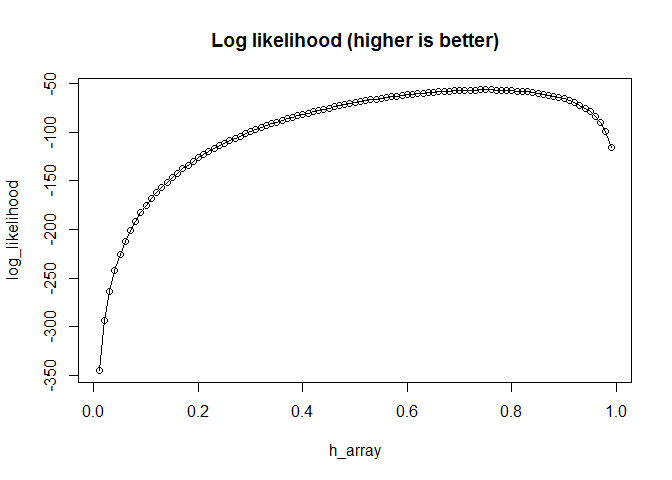

Example of issues with Brown et al. 1997 loss function
================
Michael Gensheimer
November 9, 2017

Simulated data for one time interval
------------------------------------

### Null model: Minimizing Brown 1997 loss function and maximizing log likelihood produce the same result

``` r
n_atrisk <- 100 #number of individuals at risk during this time interval
failure_prop <- 0.75 #true hazard proportion / proportion of failure during this time interval
failure <- c(rep(0,round(n_atrisk*(1-failure_prop))), rep(1,round(n_atrisk*failure_prop)))
h_array <- seq(0.01,0.99,0.01) #predicted hazard proportion -- what proportion of individuals at risk will have failure during this time interval?
brown_loss <- rep(0,length(h_array)) #Brown 1997 loss function
log_likelihood <- rep(0,length(h_array)) #log likelihood
for (i in seq(length(h_array))) {
  h <- h_array[i]
  brown_loss[i] <- sum(((1-h)*failure)^2) + sum((h*(1-failure))^2)
  log_likelihood[i] <- sum(log((h*failure)[h*failure>0])) + sum(log(((1-h)*(1-failure))[(1-h)*(1-failure)>0]))
}
plot(h_array,brown_loss, type="o") #want to minimize Brown loss
title('Brown 1997 loss function (lower is better)')
```


``` r
plot(h_array,log_likelihood, type="o") #want to maximize log likelihood
title('Log likelihood (higher is better)')
```



Predicted hazard proportion that minimizes Brown et al. 1997 loss function:

``` r
best_h <- h_array[which(brown_loss==min(brown_loss))]
cbind(h=best_h)
```

    ##         h
    ## [1,] 0.75

Predicted hazard proportion that maximizes log likelihood:

``` r
best_h <- h_array[which(log_likelihood==max(log_likelihood))]
cbind(h=best_h)
```

    ##         h
    ## [1,] 0.75

### Logistic model with one predictor variable: Minimizing Brown 1997 loss function and maximizing log likelihood produce different results

``` r
n_atrisk <- 100
failure_prop <- 0.5
failure <- c(rep(0,round(n_atrisk*(1-failure_prop))), rep(1,round(n_atrisk*failure_prop)))
x <- c(rnorm(round(n_atrisk*(1-failure_prop)),mean=0,sd=0.5), rnorm(round(n_atrisk*failure_prop),mean=1,sd=0.5))
intercept_array <- seq(-5,5,0.025)
slope_array <- seq(-5,5,0.025)
brown_loss <- array(0,c(length(intercept_array), length(slope_array))) #Brown et al. 1997 loss function
log_likelihood <- array(0,c(length(intercept_array), length(slope_array))) #log likelihood
for (i in seq(length(intercept_array))) {
  for (j in seq(length(slope_array))) {
    intercept <- intercept_array[i]
    slope <- slope_array[j]
    h <- 1/(1+exp(-(slope*x + intercept)))
    brown_loss[i,j] <- sum(((1-h)*failure)^2) + sum((h*(1-failure))^2)
    log_likelihood[i,j] <- sum(log((h*failure)[h*failure>0])) + sum(log(((1-h)*(1-failure))[(1-h)*(1-failure)>0]))
  }
}
filled.contour(intercept_array, slope_array,brown_loss)
title('Brown 1997 loss function (lower is better)')
```


``` r
filled.contour(intercept_array, slope_array,log_likelihood)
title('Log likelihood (higher is better)')
```


Model parameters that minimize Brown et al. 1997 loss function:

``` r
best_intercept <- intercept_array[which(brown_loss==min(brown_loss), arr.ind = T)[1]]
best_slope <- slope_array[which(brown_loss==min(brown_loss), arr.ind = T)[2]]
best_h <- 1/(1+exp(-(best_slope*x + best_intercept)))
cbind(intercept=best_intercept, slope=best_slope)
```

    ##      intercept slope
    ## [1,]    -1.225 3.275

Model parameters that maximize log likelihood loss function:

``` r
best_intercept <- intercept_array[which(log_likelihood==max(log_likelihood), arr.ind = T)[1]]
best_slope <- slope_array[which(log_likelihood==max(log_likelihood), arr.ind = T)[2]]
best_h <- 1/(1+exp(-(best_slope*x + best_intercept)))
cbind(intercept=best_intercept, slope=best_slope)
```

    ##      intercept slope
    ## [1,]    -1.425   3.1
