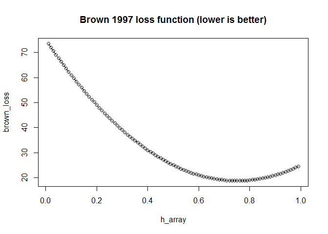

Example of issues with Brown et al. 1997 loss function
================
Michael Gensheimer
November 9, 2017

R Markdown
----------

Brown, Branford, and Moran 1997 proposed a discrete-time survival model using neural networks . For each time interval *j*, the neural network loss is defined as (adapted from eq. 17 in the reference):

$$
\\frac{1}{2}\\sum\_{i=1}^{d\_j}(1-h\_j^i)^2 +
  \\frac{1}{2}\\sum\_{i=d\_j+1}^{r\_j} (h\_j^i)^2
$$

where *h*<sub>*j*</sub><sup>*i*</sup> is the hazard probability for individual *i* during time interval *j*, there are *r*<sub>*j*</sub> individuals \`\`in view'' during the interval *j* (i.e., have not experienced failure or censoring before the beginning of the interval) and the first *d*<sub>*j*</sub> of them suffer a failure during this interval. The overall loss function is the sum of the losses for each time interval.

The authors note that in the case of a null model with no predictor variables, minimizing the above loss results in an estimate of the hazard probabilities that equals the Kaplan-Meier maximum likelihood estimate: $\\hat{h\_j} = \\frac{d\_j}{r\_j}$. While this is true, the analogy does not hold once each individual's hazard depends on the value of predictor variables. A more theoretically justified loss function would be the negative of the log likelihood function of the survival model. This likelihood function has been well studied for discrete-time survival models. Adapting eq. 3.4 from Cox & Oakes 1972 and eq. 2.17 from Singer & Willett 1993, the contribution of time interval *j* to the overall log likelihood is:
$$
\\sum\_{i=1}^{d\_j}\\ln (h\_j^i) +
\\sum\_{i=d\_j+1}^{r\_j}\\ln (1-h\_j^i)
$$

This is similar but not identical to the Brown et al.loss function and can be shown to produce different values of the model parameters for anything more complex than the null model.

``` r
#simulated loss functions for one time interval
#null model
n_events <- 100
event_prop <- 0.9
event <- c(rep(0,round(n_events*(1-event_prop))), rep(1,round(n_events*event_prop)))
h_array <- seq(0.01,0.99,0.01)
brown_loss <- rep(0,length(h_array)) #Brown 1997 loss function
log_likelihood <- rep(0,length(h_array)) #log likelihood
for (i in seq(length(h_array))) {
  h <- h_array[i]
  brown_loss[i] <- sum(((1-h)*event)^2) + sum((h*(1-event))^2)
  log_likelihood[i] <- sum(log((h*event)[h*event>0])) + sum(log(((1-h)*(1-event))[(1-h)*(1-event)>0]))
}
plot(h_array,brown_loss, type="o")
```



``` r
plot(h_array,log_likelihood, type="o")
```


``` r
#linear model
n_events <- 100
event_prop <- 0.5
event <- c(rep(0,round(n_events*(1-event_prop))), rep(1,round(n_events*event_prop)))
#x <- c(rep(0,round(n_events*(1-event_prop))), rep(1,round(n_events*event_prop)))
x <- c(rnorm(round(n_events*(1-event_prop)),mean=0,sd=0.5), rnorm(round(n_events*event_prop),mean=1,sd=0.5))
intercept_array <- seq(-5,5,0.025)
slope_array <- seq(-5,5,0.025)
brown_loss <- array(0,c(length(intercept_array), length(slope_array))) #Brown et al. 1997 loss function
log_likelihood <- array(0,c(length(intercept_array), length(slope_array))) #log likelihood
for (i in seq(length(intercept_array))) {
  for (j in seq(length(slope_array))) {
    intercept <- intercept_array[i]
    slope <- slope_array[j]
    h <- 1/(1+exp(-(slope*x + intercept)))
    brown_loss[i,j] <- sum(((1-h)*event)^2) + sum((h*(1-event))^2)
    log_likelihood[i,j] <- sum(log((h*event)[h*event>0])) + sum(log(((1-h)*(1-event))[(1-h)*(1-event)>0]))
  }
}
filled.contour(intercept_array, slope_array,brown_loss)
```


``` r
filled.contour(intercept_array, slope_array,log_likelihood)
```


``` r
#persp(intercept_array, slope_array,brown_loss, phi = 45, theta = 45)
#persp(intercept_array, slope_array,log_likelihood, phi = 45, theta = 45)
#plot_ly(z = brown_loss) %>% add_surface

best_intercept <- intercept_array[which(brown_loss==min(brown_loss), arr.ind = T)[1]]
best_slope <- slope_array[which(brown_loss==min(brown_loss), arr.ind = T)[2]]
best_h <- 1/(1+exp(-(best_slope*x + best_intercept)))
cbind('Best model parameters for Brown et al. 1997 loss function:', intercept=best_intercept, slope=best_slope)
```

    ##                                                                  
    ## [1,] "Best model parameters for Brown et al. 1997 loss function:"
    ##      intercept slope
    ## [1,] "-2.25"   "5"

``` r
best_intercept <- intercept_array[which(log_likelihood==max(log_likelihood), arr.ind = T)[1]]
best_slope <- slope_array[which(log_likelihood==max(log_likelihood), arr.ind = T)[2]]
best_h <- 1/(1+exp(-(best_slope*x + best_intercept)))
cbind('Best model parameters for log likelihood loss function:',intercept=best_intercept, slope=best_slope)
```

    ##                                                                intercept
    ## [1,] "Best model parameters for log likelihood loss function:" "-1.925" 
    ##      slope
    ## [1,] "3.7"

Including Plots
---------------

You can also embed plots, for example:
