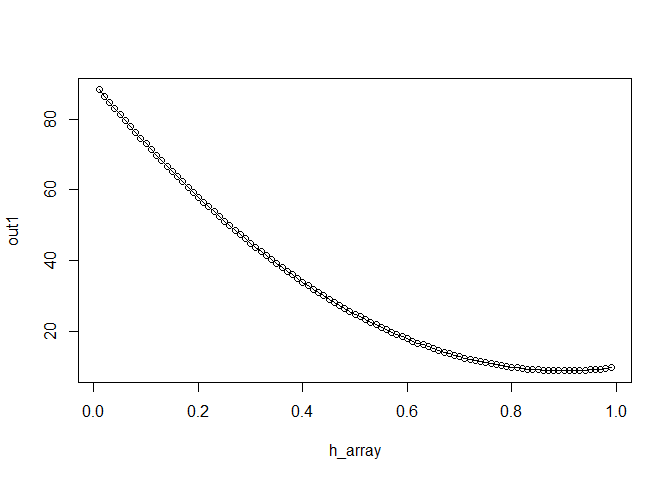
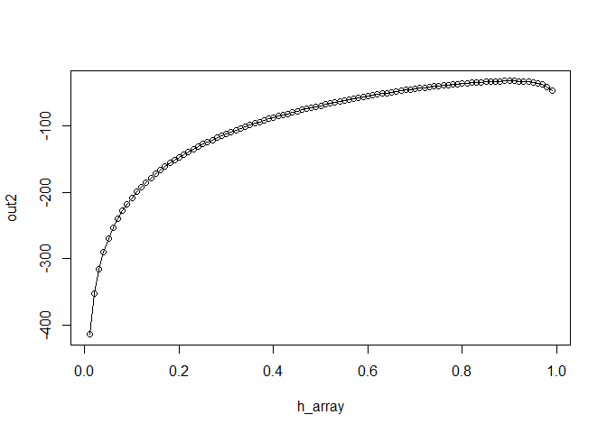
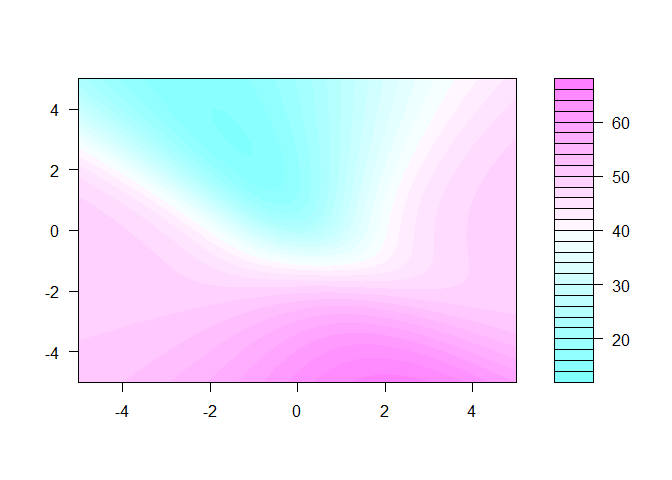
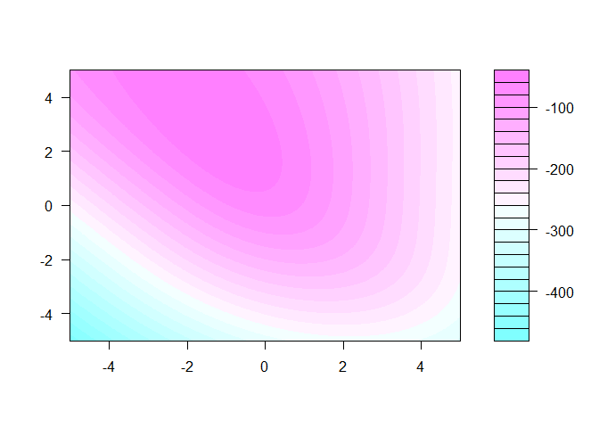

neural network survival
================
Michael Gensheimer
November 9, 2017

R Markdown
----------

This is an R Markdown document. Markdown is a simple formatting syntax for authoring HTML, PDF, and MS Word documents. For more details on using R Markdown see <http://rmarkdown.rstudio.com>.

When you click the **Knit** button a document will be generated that includes both content as well as the output of any embedded R code chunks within the document. You can embed an R code chunk like this:

``` r
#simulated loss functions for one time interval
#null model
n_events <- 100
event_prop <- 0.9
event <- c(rep(0,round(n_events*(1-event_prop))), rep(1,round(n_events*event_prop)))
h_array <- seq(0.01,0.99,0.01)
out1 <- rep(0,length(h_array)) #Brown 1997 loss function
out2 <- rep(0,length(h_array)) #log likelihood
for (i in seq(length(h_array))) {
  h <- h_array[i]
  out1[i] <- sum(((1-h)*event)^2) + sum((h*(1-event))^2)
  out2[i] <- sum(log((h*event)[h*event>0])) + sum(log(((1-h)*(1-event))[(1-h)*(1-event)>0]))
}
plot(h_array,out1, type="o")
```



``` r
plot(h_array,out2, type="o")
```



``` r
#linear model
n_events <- 100
event_prop <- 0.5
event <- c(rep(0,round(n_events*(1-event_prop))), rep(1,round(n_events*event_prop)))
#x <- c(rep(0,round(n_events*(1-event_prop))), rep(1,round(n_events*event_prop)))
x <- c(rnorm(round(n_events*(1-event_prop)),mean=0,sd=0.5), rnorm(round(n_events*event_prop),mean=1,sd=0.5))
intercept_array <- seq(-5,5,0.025)
slope_array <- seq(-5,5,0.025)
out1 <- array(0,c(length(intercept_array), length(slope_array))) #Brown et al. 1997 loss function
out2 <- array(0,c(length(intercept_array), length(slope_array))) #log likelihood
for (i in seq(length(intercept_array))) {
  for (j in seq(length(slope_array))) {
    intercept <- intercept_array[i]
    slope <- slope_array[j]
    h <- 1/(1+exp(-(slope*x + intercept)))
    out1[i,j] <- sum(((1-h)*event)^2) + sum((h*(1-event))^2)
    out2[i,j] <- sum(log((h*event)[h*event>0])) + sum(log(((1-h)*(1-event))[(1-h)*(1-event)>0]))
  }
}
filled.contour(intercept_array, slope_array,out1)
```



``` r
filled.contour(intercept_array, slope_array,out2)
```



``` r
#persp(intercept_array, slope_array,out1, phi = 45, theta = 45)
#persp(intercept_array, slope_array,out2, phi = 45, theta = 45)
#plot_ly(z = out1) %>% add_surface

best_intercept <- intercept_array[which(out1==min(out1), arr.ind = T)[1]]
best_slope <- slope_array[which(out1==min(out1), arr.ind = T)[2]]
best_h <- 1/(1+exp(-(best_slope*x + best_intercept)))
cbind('Best model parameters for Brown et al. 1997 loss function:', intercept=best_intercept, slope=best_slope)
```

    ##                                                                  
    ## [1,] "Best model parameters for Brown et al. 1997 loss function:"
    ##      intercept slope  
    ## [1,] "-1.425"  "3.125"

``` r
best_intercept <- intercept_array[which(out2==max(out2), arr.ind = T)[1]]
best_slope <- slope_array[which(out2==max(out2), arr.ind = T)[2]]
best_h <- 1/(1+exp(-(best_slope*x + best_intercept)))
cbind('Best model parameters for log likelihood loss function:',intercept=best_intercept, slope=best_slope)
```

    ##                                                                intercept
    ## [1,] "Best model parameters for log likelihood loss function:" "-1.375" 
    ##      slope  
    ## [1,] "3.125"

Including Plots
---------------

You can also embed plots, for example:
